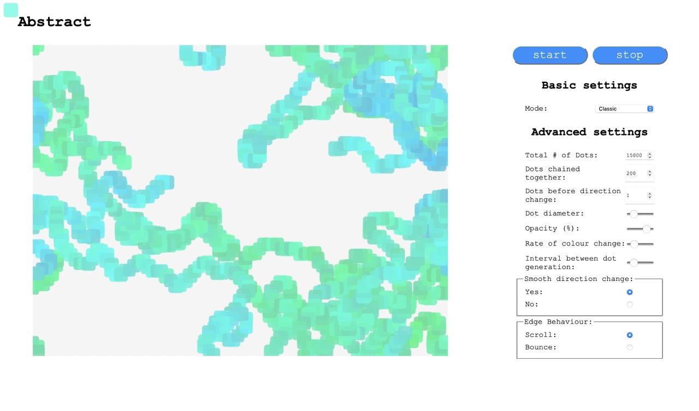

# Abstract

Create abstract images in real-time with randomly generated coloured dots.

## Instructions

Abstract is deployed online, please follow the link on GitHub to use Abstract.

Image generation will begin as soon as the app has loaded so just hit the link, sit back and enjoy.

If you're feeling creative or curious you may wish to adjust the settings and find out what other things Abstract can do. If so, look no further than the **control panel**.

### The Control Panel

The control panel sits to the left of the canvas (or below if using Abstract in mobile mode) and contains various controls for interacting with the image generator.

* Start - press this button to start a new image.
* Stop - press this button to stop image generation. 

⚠️ **Warning** - pressing the stop button completely halts the image forever and there is no way to resume an image once stopped. ⚠️

#### Basic Settings

* Mode - this menu allows you to select from a handful of different presets. It's a neat way of quickly exploring the capabilities of Abstract's image generating algorithm.

#### Advanced Settings

Not for the faint of heart!

* Total # of Dots - This is how many individual dots will be generated on the canvas. The more dots, the longer the image genreration.
* Dots chained together - Abstract works by generating a starting dot in a random position on the canvas. Each new dot is placed next to the previous one and these chained dots form a virtual brushstroke. The number of dots chained together represents the length of a brushstroke. Upon reaching the end of a brushstroke a new starter dot is generated.
* Dots before direction change - After every few dots, the direction of the brushstroke will change, use this setting to alter how often the direction changes.
* Dot diameter - How large or small the dots are.
* Opacity - How see-through the dots are (Go left for more see-through and right for more solid)
* Rate of colour change - Adjust how often the dots change colour (left is none and right is frequently)
* Interval between dot generation - How quickly a new dot is added to the image (go left for speedy and right for slow).

⚠️ **Warning** - Abstract experiences reduced performance on mobile devices so image generation tends to be on the sluggish side. You may not notice much/any difference when lowering the generation interval. ⚠️

* Smooth direction change - 
    * Yes - This will ensure that direction change are limited to a smaller angle with no jerky movement.
    * No - all bets are off and the brushstroke can choose any direction (even backwards!).
* Edge Behaivior - 
    * Scroll - When a brushstroke reaches the edge of the canvas it will reappear on the opposite side.
    * Bounce - When a brushstroke reaches the edge of the canvas it will be bounced back in the opposite direction.